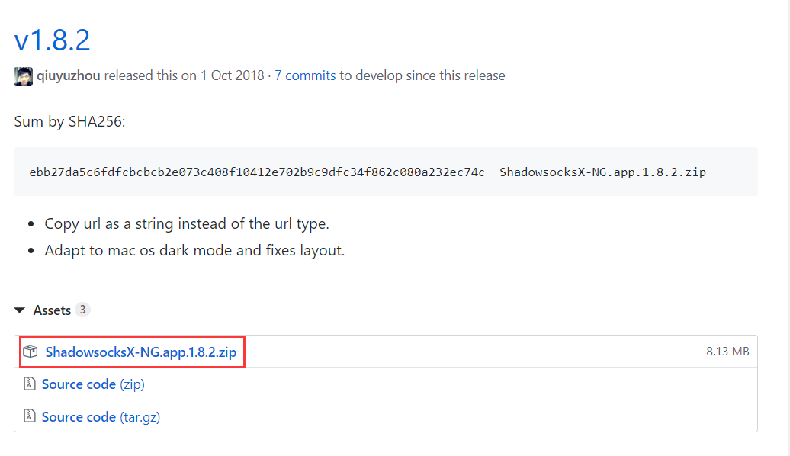
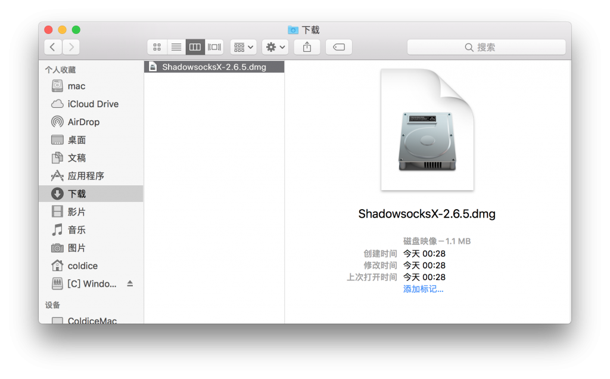
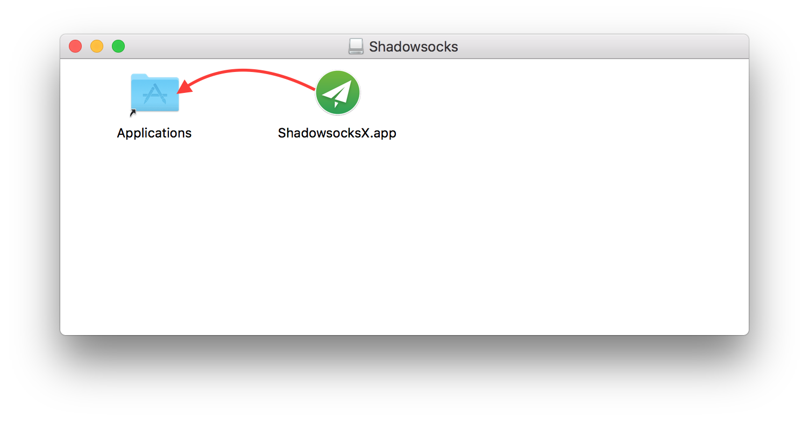
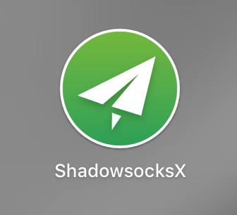
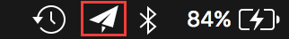
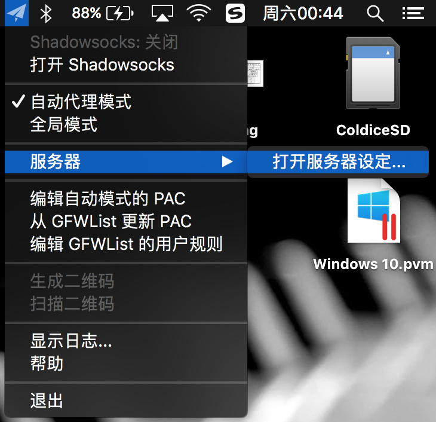
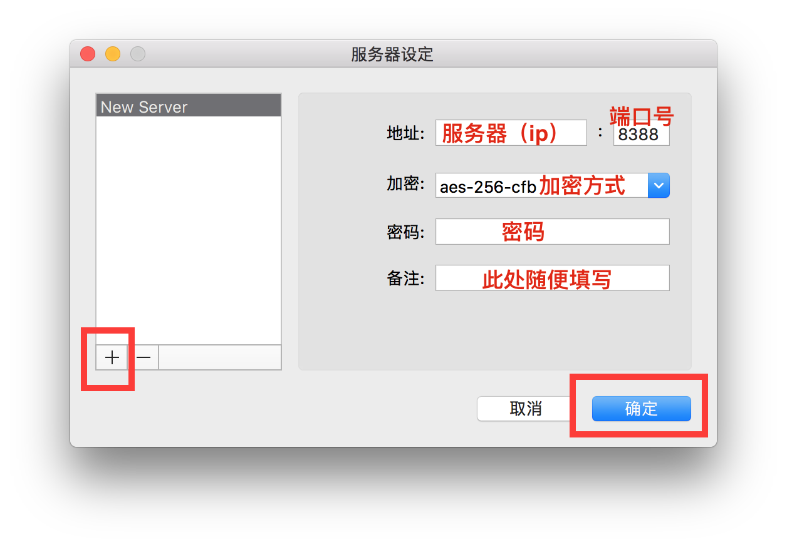
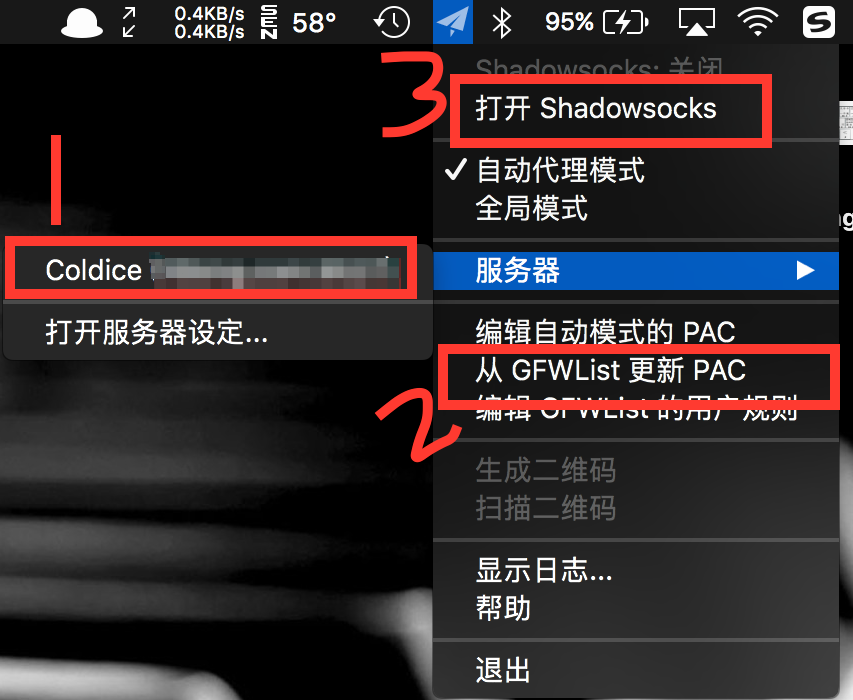
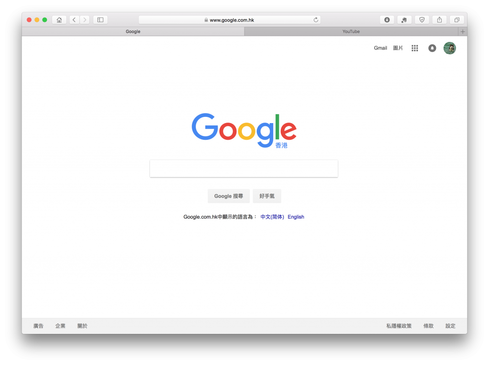

<h1>Mac OS端如何配置shadowsocks</h1>

<h3>1、下载Mac版本的ShadowsocksX</h3>

From <a href="<https://github.com/shadowsocks/ShadowsocksX-NG/releases/>">here</a> （下载最新版）

<h4>一般默认会下载到的位置是在“下载”文件夹里，如图所示</h4>

<h3>2、双击打开该文件，把 ShadowsocksX.app 拖到 Applications 文件夹中，完成安装。</h3>

<h3>3、四指在触控板上捏拢，或者点击 Dock 栏上的 Launchpad 打开应用界面，找到刚装好的 ShadowsocksX，点击打开。</h3>

<h3>4、这时查看桌面右上角的菜单栏，找到小飞机图标，点击。</h3>

<h3>5、点击服务器里的打开服务器设定，如图。</h3>

<h3>6、点击加号➕添加服务器参数配置，具体填写按照服务提供商提供的参数填写，填写完毕后，点击确定保存。</h3>

<h3>7、按下图所示，先选择服务器，然后从 GFWList 更新下 PAC，最后通过打开和关闭来控制 Shadowsocks 的开关。（个人建议如果没有特殊情况，选“自动代理模式”即可）。</h3>

<h3>8、可以上Google了。</h3>

